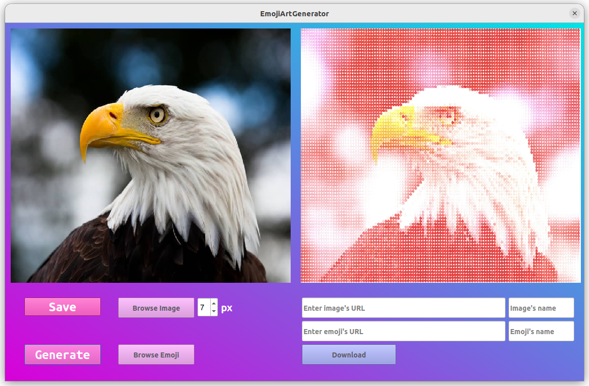

# EmojiArt

This is extended version of EmojiArtGenerator program with graphical interface.Now you can download images providing URLs and generate images consisting from emoji-image.

## Features

- downloading image/emoji 
- generating EmojiArt
- choosing emoji's pixel size
- saving results

## Instalation

1. Clone this repository.
    - `git clone https://github.com/Kalashyan-1/EmojiArt.git`
2. Navigate to the program directory.
    - `cd EmojiArt`
2. Run the run.sh script.
    - `./run.sh`

## Requirements

- Python3
- PyQt
- G++ compiler
- OpenCV

### Warning

For some images color channels that are incompatible for generation you will get message.

### Example

#### Original Image

#### Emoji Image

#### Result Image

